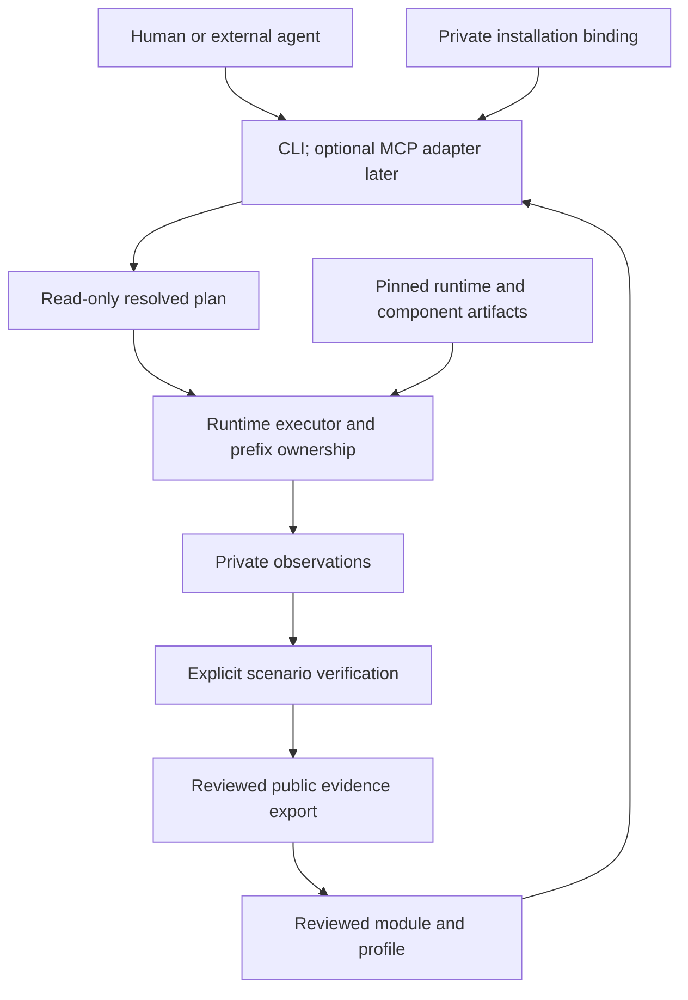

# PortCellar architecture and migration proposal

Date: 2026-09-07. Status: foundation implemented; public release remains gated.
Audience: maintainers and contributors.

The later [foundation decisions](foundation-decisions.md) select the initial
module contract, execution ownership, stage preservation, and Steam update
policy. They take precedence over the corresponding recommendations here.

## Recommendation

Rebrand and preserve the existing runtime. Import a reviewed, sanitized source
snapshot, then make SimCity 4 the first complete module. Start with the existing
CLI/core crate boundary and extract game policy before introducing more crates.

The important additional planning is about identity, state ownership, execution
contracts, Steam updates, evidence, and distribution. A six-crate layout alone
does not establish these boundaries.

The initial supported investigation target should be Apple Silicon/macOS, with
Windows Steam and standalone installations as separate workflows. Intel hosts
can remain a candidate path until tested. The mission is to increase the number
of games and scenarios people can run; it is not a promise that every game,
anti-cheat system, or future macOS version will work.

This proposal recommends revisions to the original [concept](../../PortCellar.md),
especially its directory names, compatibility ladder, runtime version ranges,
and immediate crate split. It preserves the original document as background.

## What actually exists

The local PortCellar directory contained only `PortCellar.md` at inspection and
was not a Git checkout. GitHub's public repository API returned an empty public
PortCellar repository (`size: 0`). No visibility setting was changed. [S1]

The inspected lite-crossover worktree was based on commit
`71a5d09ab9491bfbff23a07e387a88273229d3c2`, with staged, unstaged, untracked, and
modified upstream content. The commit alone does not identify the working system.
In particular, runtime staging and SCGL work include untracked files.

The paths below refer to the inspected legacy worktree, not files already
imported into PortCellar.

| Existing implementation | Preserve and extend |
| --- | --- |
| `crates/lite-cli`, `crates/lite-core` | A real two-crate workspace, with tests and a small dependency set (`serde`, `toml`) |
| `src/games/generic.rs`, `games/catalog.rs` | TOML profiles and a catalog; evolve these rather than build a parallel module loader |
| `src/analyze/{pe,discovery,local,steam_client}.rs` | Executable analysis, local-game discovery, and Steam/CEF diagnostics |
| `src/runtime/{launch,profile,preflight,dependencies}.rs` | Launch/configuration plans, prerequisite checks, snapshots, and rollback |
| `src/runtime/{observe,session,steam_cef}.rs` | Live Steam state, process cleanup, and WebHelper preparation |
| `src/runtime/stage.rs` | Copying a standalone installation before injecting artifacts or applying the LAA change |
| `src/runtime/smoke.rs` | Structured compatibility records and local history; currently much narrower than scenario evidence |

Game-specific constants and wrappers remain in `anchors.rs`, `games/isaac.rs`,
public exports, and CLI paths. Some shared Steam operations still route through
Isaac-centric discovery. These must be traced through callers before migration.

Observed gaps that affect the architecture:

- `GenericGameProfileDocument.app_id` and catalog uniqueness conflate a generic
  identifier with a Steam identifier; local analysis already creates local IDs.
- `game_launch_plan()` calls the staging path with materialization enabled. A
  function named "plan" is therefore not always read-only today.
- Staging currently requires a non-Steam profile with runtime artifacts. The SCGL
  preflight explicitly rejects Steam integration. A standalone SC4 result must
  not become a claim about Steam SC4.
- Staging refresh removes the previous staged game before copying its replacement.
  Saves or user changes inside that directory need an explicit preservation policy.
- Stage fingerprints use FNV-style hashing for cache reuse; they are not release
  integrity hashes. Public runtime/game/patch artifacts need SHA-256 identities.
- The evidence history chooses a free filename and then writes it; this does not
  establish safe concurrent writing. Prefix mutation checks also need locking,
  rather than relying only on a preflight observation of stopped processes.
- `command.rs::run_plan` maps an unavailable numeric exit code to zero. Signal
  termination must remain a failure/interruption in the future execution contract.
- Project-root discovery requires both `Cargo.toml` and an existing `.portcellar/`
  directory. Replace that assumption deliberately; renaming only the directory
  would change discovery behavior, and an installed CLI needs its own state root.
- Prefix process attribution currently uses substring matching in `lsof` output.
  Similar path names and shared process groups need coverage before claiming safe
  concurrent isolation.
- The backend matrix has policy labels such as `Verified`; these are not game
  scenario verification. Keep backend eligibility separate from measured claims.

These are source-level findings, not fixes or newly executed gameplay tests.

## Options and the first useful architecture

| Approach | Tradeoff | Recommendation |
| --- | --- | --- |
| Sanitized import, two crates, one end-to-end module | Preserves working behavior; requires deliberate boundary cleanup | Start here |
| Immediate split into all six proposed crates | Provides package boundaries early but moves intertwined types and orchestration before contracts settle | Defer until ownership is demonstrated |
| Rewrite as an agent framework | Rebuilds working runtime behavior and couples progress to an orchestration system | Do not choose |

The target dependency direction is:



The runtime must run a reviewed module without an LLM account. Agents propose
changes and use tools; they are not an always-running dependency of gameplay.
There is no need for an agent daemon, hosted database, module marketplace, or
multi-agent scheduler for the first release.

### Initial imported layout

This is a target, not the current file inventory. Create directories when there
is reviewed content to place in them.

```text
portcellar/
  Cargo.toml
  Cargo.lock
  README.md
  AGENTS.md
  LICENSE                         # MIT OR Apache-2.0; third-party terms retained
  THIRD_PARTY_NOTICES.md
  crates/
    portcellar-cli/
    portcellar-core/
      src/
        analyze/
        runtime/
        modules/                  # evolved existing profile/catalog code
        evidence/                 # evolved existing smoke evidence code
  modules/
    simcity-4/
      README.md
      module.toml
      profiles/
      patches/scgl/
      tools/check-scgl-texture-abi.py
      tests/
      evidence/                   # selected, sanitized, reviewed records
      docs/investigation.md
    binding-of-isaac-rebirth/       # once its profile and evidence are imported
  components/
    steam/                        # shared policy, scenarios, and update notes
  runtimes/wine/
    manifests/
    recipes/
    patches/
  schemas/                        # only contracts the implementation consumes
  agents/
    README.md
  docs/
    architecture/
    releases/
  scripts/
  upstreams/                      # optional pinned source checkouts, not binaries
  .github/workflows/
  .portcellar/                    # ignored local state
```

`components/steam/` is justified by existing cross-game Steam behavior. It is
data/documentation owned by runtime Steam code, not a new plugin framework or
crate. Wine source patches belong under `runtimes/wine/patches/`, including a
Wine patch first discovered through SC4. The SC4 module selects the required
runtime variant rather than duplicating that patch. SCGL source patches remain
in the SC4 module until actual reuse justifies a shared component.

Do not create an empty Final Fantasy VI module or give it a status from its
presence in the original tree. Import its actual profile and review evidence first.

A CLI-only build must not require cloning every runtime upstream. Fetch pinned
sources explicitly for the selected build recipe; an SCGL investigation does not
need the complete GStreamer/DXVK source and test-data trees.

The eventual names `portcellar-runtime`, `portcellar-analyzer`,
`portcellar-module`, and `portcellar-evidence` remain sensible extraction options.
Extract when a second consumer or a stable dependency boundary requires it.
Extract neutral contract types first if a split would otherwise introduce cycles.
A later agent transport may be `portcellar-mcp`; a generic `portcellar-agent`
crate is unnecessary until it has a defined responsibility.

## Identity and module contracts

Use four separate identities:

| Identity | Meaning |
| --- | --- |
| Module ID | Stable project key, such as `simcity-4`; independent of a storefront |
| Variant ID | Edition/distribution/build/architecture/language combination |
| Installation ID | A particular user's local installation; private binding to a path/prefix |
| Run ID | One resolved execution or investigation, with immutable input references |

Store IDs such as a Steam App ID are optional namespaced metadata. Steam
integration (`required`, `optional`, `none`) is execution policy, distinct from
where a user acquired the files. An import of `steam_api.dll` is evidence of a
dependency; it does not determine ownership, authenticate a user, or authorize
bypassing that dependency.

A module declares known variants, executable selection, runtime requirements,
profile references, artifacts, scenarios, and known limitations. A profile holds
configuration for one route. Local installation paths, engine paths, account
state, and user overrides live in private installation bindings.

Use TOML for authored module/profile configuration and JSON for command results
and evidence interchange. JSON Schema validates the parsed TOML data model; it
does not validate TOML text directly. Reuse the existing serde/TOML types and
derive or verify schemas against the same model. Do not maintain unrelated
Rust and JSON validators that accept different data.

Version the module format separately from the module content and CLI API. Reject
unknown format versions and misspelled policy fields. Define a migration for old
`game-profile-v1` input rather than silently interpreting it under new semantics.
Keep legacy evidence readers where useful, but do not upgrade a smoke pass to a
scenario pass during conversion.

Public profiles must resolve artifacts by reviewed identifier and digest. Validate
archive extraction, relative paths, symlinks, architecture, and patch preimages.
Do not accept an arbitrary URL, shell string, or module script as trusted merely
because it appears in TOML.

Start with one selected profile plus a finite set of declared shared component
requirements. Reject conflicting registry keys, DLL destinations, environment
settings, or patch versions unless the selected profile explicitly resolves them.
Defer arbitrary profile inheritance and a general dependency solver.

## Runtime and private state ownership

The first public runtime must describe the actual stack, not only "Wine 11.10":

- Host OS/build and CPU family; CLI host architecture.
- Wine process architecture and guest executable architecture/WoW64 mode.
- CPU translation provider and availability.
- Source revisions, patch-set digest, build recipe/toolchain, and artifact SHA-256.
- Graphics, audio, and media components and their versions.
- Exact tested profiles/scenarios and distribution provenance.

Determine runtime capabilities from an inspected manifest and actual components,
not from a directory name or a generic engine-family label. A candidate graphics
backend is still subject to the selected build's API and architecture limits.

Apple states that Rosetta remains generally available through macOS 27 and is
restricted to certain older unmaintained games from macOS 28. It does not state
that an arbitrary Wine engine qualifies for that exception. Record Rosetta as a
runtime requirement and plan a separate feasibility investigation for future
translation routes; do not promise an unproven replacement. [S2]

Valve describes Proton as a Linux compatibility tool. Reuse its engineering
ideas and inspect relevant open-source fixes, but do not present installing
Proton as a supported macOS runtime route. [S3]

For a source checkout, `.portcellar/` should contain ignored engines, prefixes,
installation bindings, workspaces, builds, traces, and evidence. For an installed
CLI, use macOS Application Support for durable private state and Caches for
rebuildable downloads/builds, with an explicit state-root override. Never make
save durability depend on a Git checkout or the current working directory.

Engines are immutable versioned artifacts. Prefixes are mutable and owned by a
specific installation/Steam group. An intentional shared Steam prefix is allowed,
but incompatible simultaneous launches and all mutations must serialize under a
prefix-scoped lock. State-changing operations must recheck their fingerprints
after acquiring the lock. Do not add a global lock that blocks independent games.

Treat game saves as durable user data, even when a game writes beside its EXE.
Identify save locations, snapshot before experiments, and preserve both originals
and recovery copies through profile/runtime updates. A stage refresh must build
a replacement before activation and must not discard the previous stage's saves.
Do not use hard links when a patch could modify an original file through them.

Wine prefixes isolate configuration, not host filesystem access. The execution
plan must describe real host writes, mapped directories, and network operations.
Unknown executables are not made safe merely by launching them through Wine.

## Steam is a maintained shared component

Maintain PortCellar's integration with the Windows Steam client. Do not plan to
fork Valve's proprietary client or distribute a logged-in prefix.

Reuse current session observation, client/CEF analysis, and WebHelper handling,
while removing Isaac-specific entry points. Maintain a shared Steam policy with
its own revision and tests, separate from Wine and each game module.

For each tested Steam route, record the client channel/build when observable,
Steam executable and CEF fingerprints, helper architecture, integration policy,
runtime, and game manifest/build identity. Separate two facts:

- A historical run used these exact bits and passed these scenarios.
- The current client/build is eligible for this policy and has current evidence.

Steam updates can change client/helper files independently of a pinned Wine
artifact. Detect such changes, preserve the previous evidence, and mark the new
combination unverified until tested. Do not promise indefinitely frozen Steam
versions or unconditional restoration of old clients; authentication services
and update availability are external dependencies.

The shared smoke suite should cover first bootstrap, login requiring human input,
active session, library UI, install request/progress, game launch, client restart,
update detection, wrapper replacement, and prefix-scoped shutdown. A Steam client
update run should recheck at least one established Steam game. Offline mode,
overlay, controller behavior, and cloud saves need separate scenario records.

Current CEF arguments include `-no-cef-sandbox` and `-noverifyfiles`. Do not make
those universal PortCellar defaults just because they exist today. Test the
default client path first; retain exceptions only in an explicit tested policy
with the reason, applicability, and removal condition recorded.

Windows Steam should install/update through the user's legitimate Valve client
flow. Credentials and Steam Guard prompts remain local. SteamCMD is not required
for the initial player workflow; its documentation was inaccessible during this
review, and no claim about its suitability for arbitrary retail games is made.

For standalone games, allow a local installed directory or an explicitly selected
installer. Resolve launchers and game executables separately, preserve original
files, and treat missing required store authentication as a dependency to resolve.

## Evidence defines the compatibility claim

Maintain separate axes for module maturity, verification scope, and a run result.
`Experimental` is maturity; `Getting Started Tutorial` is scope; `pass` is a
result. A module can pass one scenario and fail another without either record
being overwritten by a single "highest level" label.

Each verification record needs:

- Module/variant and input game executable digest, including any transformed copy.
- Module/profile revision, runtime artifact, patches, and optional Steam fingerprint.
- Host/translation configuration and scenario ID/version.
- Result (`pass`, `fail`, `unknown`, or `inconclusive`), duration, and observation time.
- Method (`binary-check`, `process-observation`, `human-report`, or another explicit method).
- Verifier version, artifact references/digests, and limitations.

"Analyzed" belongs to investigation progress. A process surviving 30 seconds is
a launch observation. A tutorial pass is one scenario. Neither automatically
establishes gameplay, save/load, plugin compatibility, or a playthrough.

A runtime requirement such as a minimum version expresses eligibility, not proof
that every newer version works. Prefer `requires` and `tested_with` fields over
an apparently authoritative `compatible >= version` range.

New game/runtime/module/Steam inputs create an unverified combination; they do
not erase a valid historical result. A failed rerun of the same scenario must be
retained and reflected in the summary. Conflicting reports remain visible with
their configurations. Community reports have provenance and review state; a
maintainer review confirms the record's quality, not a gameplay test the
maintainer did not perform.

Use append-only run records with atomic creation. Keep raw logs and screenshots
private by default. A public export is an allowlisted subset with its own digest
and provenance; changing/redacting an artifact changes its digest. Review text
and image content for paths, account identifiers, notifications, and game content
before release. `.gitignore` does not prevent manual uploads or identify secrets
inside a permitted file.

## Modern agent conventions without framework dependence

[AGENTS.md](https://agents.md/) explicitly complements a human README. Put the
short entry point at repository root and link detailed workflows in `agents/`.
`agents/` itself is not an automatically discovered standard. Codex has documented
root-to-current-directory instruction discovery; nested guidance should be used
only where scope differs. Claude Code documents a `CLAUDE.md` import bridge to
the shared `AGENTS.md`. [S4, S5, S6]

Agent Skills define reusable instructions with `SKILL.md` metadata. Adopt the
format for a repeatable investigation once it is exercised; client-specific
discovery still needs testing. MCP adds tool discovery and typed results, but
does not replace CLI contracts, authorization, or isolation. Start with the CLI
contract in [the agent guide](../../agents/README.md), then add an adapter if a
real consumer needs it. [S7, S8]

Apple now publishes game-porting agent skills, workflow state, and Metal tooling
guidance. Reuse applicable debugger/profiling knowledge after checking version
requirements and licenses. Its source-porting workflows do not mean PortCellar
can translate any closed-source Windows game into a native Mac application. [S9]

## Sanitized migration and distribution

The recommended import is a clean, reviewable snapshot with provenance. Keep the
old repository and working state intact. The owner will change its visibility
later. Making a repository private does not retract copies already obtained.

Before import, inventory tracked files, untracked implementation work, submodule
revisions and local diffs, and the actual lockfile. Preserve a private migration
manifest so the source snapshot can be reconstructed. A clone of HEAD alone
would omit important SCGL and staging changes.

Allowlist first-party Rust source/tests, selected build scripts, sanitized
technical documentation, source patches, reviewed modules, license notices, and
required upstream pins. Exclude career/device/personal notes, full raw traces,
local profiles with installation paths, game payloads, account state, engines,
downloads, build outputs, and historical Git metadata from the public snapshot.

The scoped audit found 17 tracked documents containing Korean, plus two untracked
documents. Three test files contain identifying local-path fixtures. The local
history also contains personal commit metadata and historical content; translating
the current README would not sanitize a history-preserving import. These counts
are migration inputs, not proof that a secret scan has covered every local file.

English-only means first-party maintained prose and diagnostics are English.
Replace identifying test fixtures with synthetic paths. Do not remove required
third-party names, copyright notices, or licenses, and do not turn language
cleanup into an ASCII-only runtime limitation. Review filenames, metadata,
generated artifacts, commits, release assets, and image content as well as prose.

Select a first-party license before public source release. No root license was
present in the initial PortCellar workspace. Do not assume that a chosen Rust
license applies to imported C sources, Wine patches, or runtime dependencies.
The license for copied/derived code must be evaluated file by file.

The embedded Steam WebHelper wrapper has an existing MIT attribution that must
survive rebranding. SCGL and Wine have LGPL obligations; optional GStreamer
components can introduce different licenses. A public MacPorts recipe can name
a commercial payload. Preserve source provenance and inventory the actual
distributed dependency closure instead of treating every upstream checkout as
equally redistributable.

For each distributed artifact, record source URL/revision, license, modifications,
build instructions, notices, and the corresponding source/required offer as
applicable. Wine's LGPL obligations need an explicit compliance plan. A generic
"open source" label and checksums alone are insufficient. [S10]

Keep three independently versioned products: the PortCellar CLI, a Wine runtime
artifact, and a game module. A runtime package must include a dependency inventory
and evidence that it does not require developer-local Homebrew/MacPorts paths.
Test relocation, architecture, deployment target, and Gatekeeper behavior on a
clean host. Decide signing/notarization before advertising a frictionless
player download. Do not ask users to disable host security globally.

Only allowlisted redistributable content belongs in archives. Locally detected
CrossOver, GPTK, D3DMetal, Steam, or Microsoft components are not automatically
redistributable. Keep externally supplied components distinct from managed
open-source runtime assets. Pin checksums and validate archive contents before
activation; update in a separate location and retain rollback material.

Valve's Proton documentation describes title-specific anti-cheat enablement and
unsupported kernel-space solutions in its Linux context. Do not generalize that
support to macOS or promise that agent iteration will remove vendor constraints.
Classify blocked authentication/anti-cheat routes honestly. [S11]

## Delivery sequence and acceptance checks

| Stage | Deliverable | Smallest meaningful proof |
| --- | --- | --- |
| 0. Preserve and inventory | Private snapshot manifest; public allowlist; licensing decision | Every imported change, submodule diff, and file has a known origin; old worktree remains intact |
| 1. Rebrand the runtime | Existing two crates imported as CLI/core; neutral paths/env/config; human README | Existing Rust checks pass on the import; help works; synthetic home with spaces/Unicode works; dry-run writes nothing |
| 2. First real module | SC4 profile, patch, checker, pinned inputs, scenarios, English investigation | Old DLL fails and new DLL passes the bounded ABI checker; exact gameplay scenario is re-observed and attributed |
| 3. Safe repeatable execution | Installation bindings, state ownership, plan/execute separation, durable evidence | Interrupted stage/update preserves originals and saves; concurrent mutation is rejected; signals/timeouts cannot pass |
| 4. Player package | CLI/runtime/module assets and source compliance material | Clean-host install, launch, update/rollback, checksums, and package inventory pass without developer tools |
| 5. Steam maintenance | Shared Steam policy, current-client smoke suite, one reviewed Steam game module | Client update changes eligibility; login and owned shutdown work; game smoke rechecks run against the new client |
| 6. Broader contributor tooling | Stable JSON contracts; optional MCP/skills | A second person/agent reproduces an investigation without private conversation context |

Stages 2 and 3 may overlap, but public downloads must pass both. A source-only
SC4 technical publication may precede a turnkey player package if labeled
accurately and independently reproducible. Do not hold that technical publication
for a six-crate split, all other games, or a hosted agent platform.

CI should first preserve existing Rust tests and add schema/fixture consistency,
English/privacy publication checks, and the SCGL binary check on a pinned source
build. CI does not possess retail game files or Steam credentials. Game scenarios
run on authorized local hardware and produce reviewed evidence. Do not run
untrusted pull-request code on a machine holding a player's Steam session.

Success is a second person reproducing a scoped result with known inputs, fewer
manual setup steps, preserved saves, and a usable failure report. Count verified
scenario/configuration pairs and reproduced regressions, not optimistic game
badges or the number of agents launched.

## Owner decisions and remaining choices

1. **First-party license and public attribution: selected.** MIT OR Apache-2.0,
   with `dotcom07` as the public identity; preserve third-party obligations.
2. **First release deliverable: selected.** Reproducible SC4 source publication
   first, followed by a player runtime package after clean-host validation.
3. **Distribution identity.** Decide signing/notarization and binary hosting when
   the player package is ready; no paid service is needed for this planning work.

All other defaults above are recommendations that can be implemented incrementally.
They do not authorize a visibility change, history rewrite, upload, or community post.

## Sources and research limits

Primary sources were retrieved on 2026-09-07. Live documentation may change;
capture revisions for sources used in a release build. This review traced the
existing code and publication material; it did not build the whole runtime or
rerun any game. The separate SCGL binary audit and coordinating reviewer did
exercise the existing SCGL checker on local old/new DLLs:
normal execution distinguishes them, while optimized Python incorrectly passes
the old DLL. See the [dated checker record](../releases/simcity-4-first-public-release.md#checker-verification-record-2026-09-07)
and SC4 release blockers.

| ID | Source | What it supports |
| --- | --- | --- |
| S1 | [GitHub repository API](https://api.github.com/repos/dotcom07/PortCellar) | Public repository metadata observed at review time |
| S2 | [Apple: Intel-based apps and Rosetta](https://support.apple.com/en-us/102527), published February 16, 2026 | Rosetta availability and macOS 28 limitation; no assurance for Wine |
| S3 | [Valve Proton README](https://github.com/ValveSoftware/Proton/blob/master/README.md) | Linux target and existing compatibility engineering model |
| S4 | [AGENTS.md](https://agents.md/) | Human README versus agent instructions; root/nested guidance |
| S5 | [OpenAI: custom instructions](https://developers.openai.com/codex/guides/agents-md) | Actual Codex instruction discovery and scope |
| S6 | [Claude Code memory](https://code.claude.com/docs/en/memory#agentsmd) | `CLAUDE.md` import bridge; no automatic `AGENTS.md` loading |
| S7 | [Agent Skills specification](https://agentskills.io/specification) | `SKILL.md` structure and metadata |
| S8 | [MCP tools, 2025-11-25](https://modelcontextprotocol.io/specification/2025-11-25/server/tools) | Input/output schema and structured results; untrusted annotations |
| S9 | [Apple Game Porting Toolkit](https://developer.apple.com/games/game-porting-toolkit/) and [official repository](https://github.com/apple/game-porting-toolkit) | Existing agent skills, source-porting workflows, and version requirements |
| S10 | [Wine license](https://github.com/wine-mirror/wine/blob/master/COPYING.LIB) | LGPL text; component-specific obligations still require review |
| S11 | [Steamworks: Proton](https://partner.steamgames.com/doc/steamdeck/proton) | Linux anti-cheat enablement and stated kernel-space limitation |

SteamCMD returned an anti-bot challenge and Simtropolis returned HTTP 403. No
attempt was made to bypass those restrictions. SC4Evermore's public site confirms
Downloads and a Discord link, but this review did not inspect private Discord
channel names or current posting permissions. Reddit's current rules and the
claimed 2026 discussion examples were not verified. Recheck community rules at
publication time; these gaps do not determine the repository architecture.
